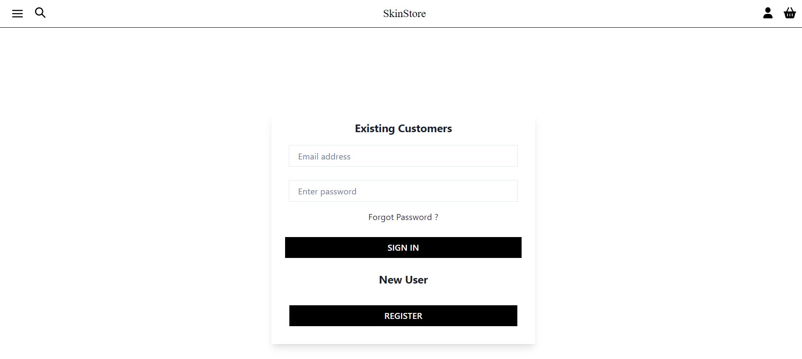
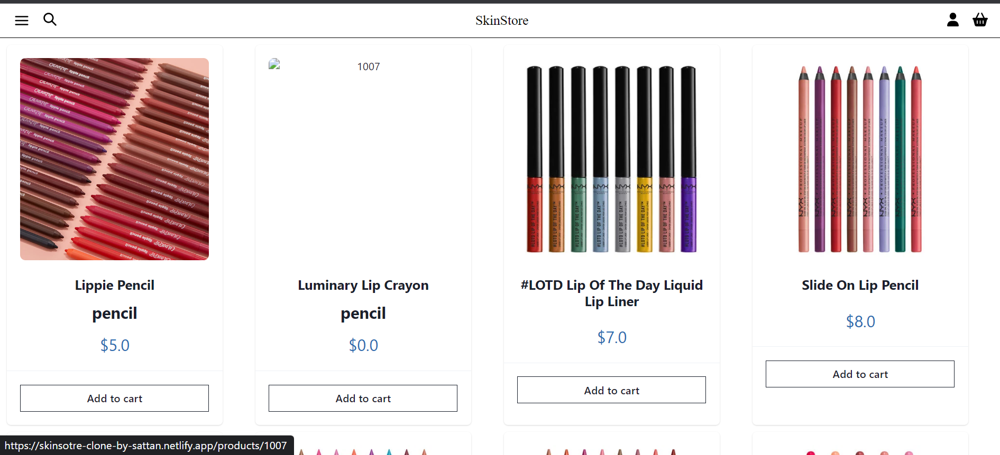

# Skin Store

This is E-commerce website. I try to implement my best possible knowledge to showcase and try to grab attention of users where they are looking for beauty products. 

# [Netlify Link](https://skinsotre-clone-by-sattan.netlify.app/)

## Demo Login Credentials

**Use this Credentials to Login as a user.**

 `Email:-eve.holt@reqres.in`
 `Password:-sat1234`

# Tech Stacks Used

 `React JS` `Chakra UI` `Javascript` `CSS`

# Features

- Navigation Bar and Footer is well aligned.
- Authenication is provided .
- Products page where all the products is provided and user Add to Cart it accordingly.
- Login is provided useing Api.
- Special Order Management System is Provided for to dynamically Change the quantity   of Product available in Cart .

# Overview

<h3> Home Page Image ↓<h3/>

<h3> Side Bar Image ↓ <h3/>

<h3> Login Page Image ↓ <h3/>

<h3> Product Page Image ↓ <h3/>

<h3> Cart Page Image ↓<h3/>

